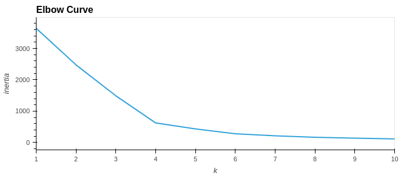
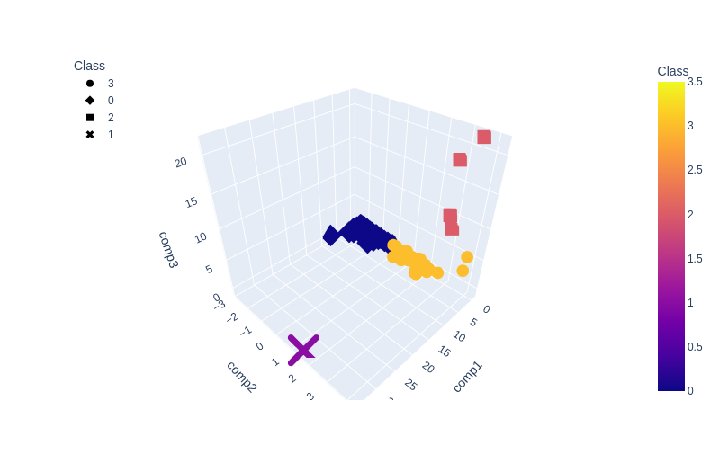
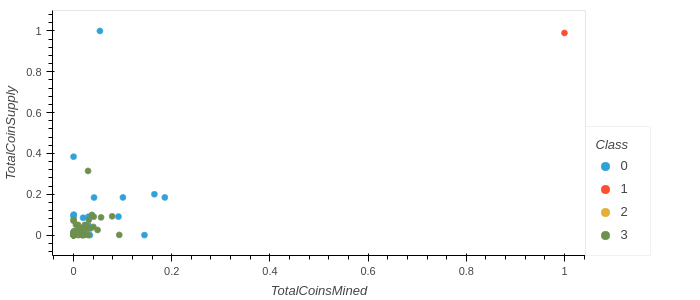

# Cryptocurrencies
## Overview
In this project, I am working on the crypto currency dataset. The goal of our analysis is to build a machine learning model to cluster similar crypto currincies in the trading market together.

For this problem,I used the KMeans algorithm. Some data preprocessing needed to be done in order to start using the data. First filteration was done, then data encoding was applied using pandas `get_dummies()`. I applied standard scaling and reduced the data dimensionality using PCA into three principal components. Using these three principal components, I trained the KMeans model.

## Results

Results found during conducting our analysis.

##### Using elbow method, we can see that k = 4 is recommended for this data

##### 3D scatter of the 3 pca components alognside with the KMeans predicstions

##### Scatter plot of x=TotalCoinsMined and y = TotalCoinSupply

## Summary

It's much easier to plot the data and visualize the results by using the power of PCA in dimensionality reduction. I found out that K = 4 is the best value for our KMeans model. Training the model using these principal components and with K = 4, I grouped similar crypto currencies together.
